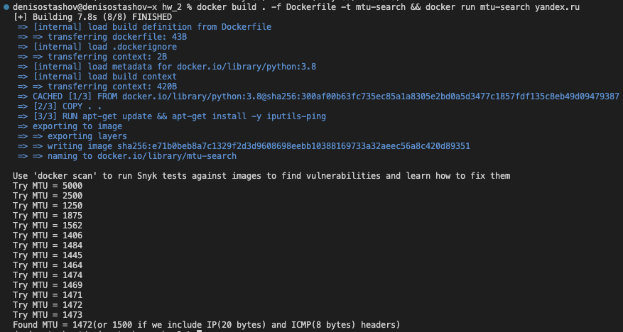

### Документация

Пусть хотим найти MTU для хоста host

1. Собираем докер  
`docker build . -f Dockerfile -t mtu-search`
2. Запускаем докер, получаем ошибку или находим MTU для хоста host  
`docker run mtu-search << host >>`

### Пример
 `docker build . -f Dockerfile -t mtu-search && docker run mtu-search yandex.ru`

